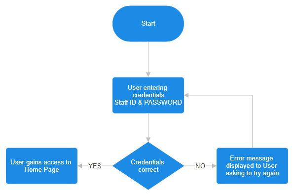
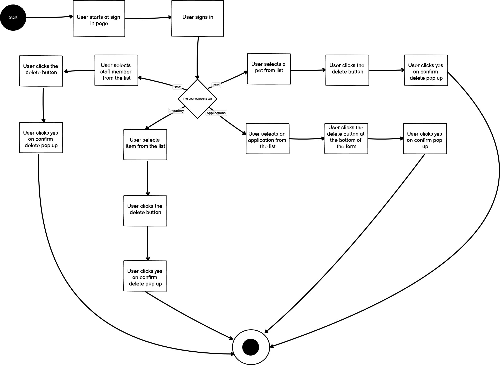
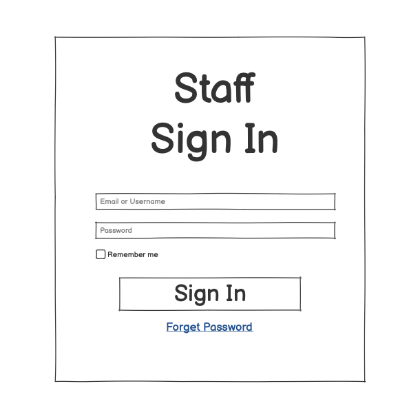
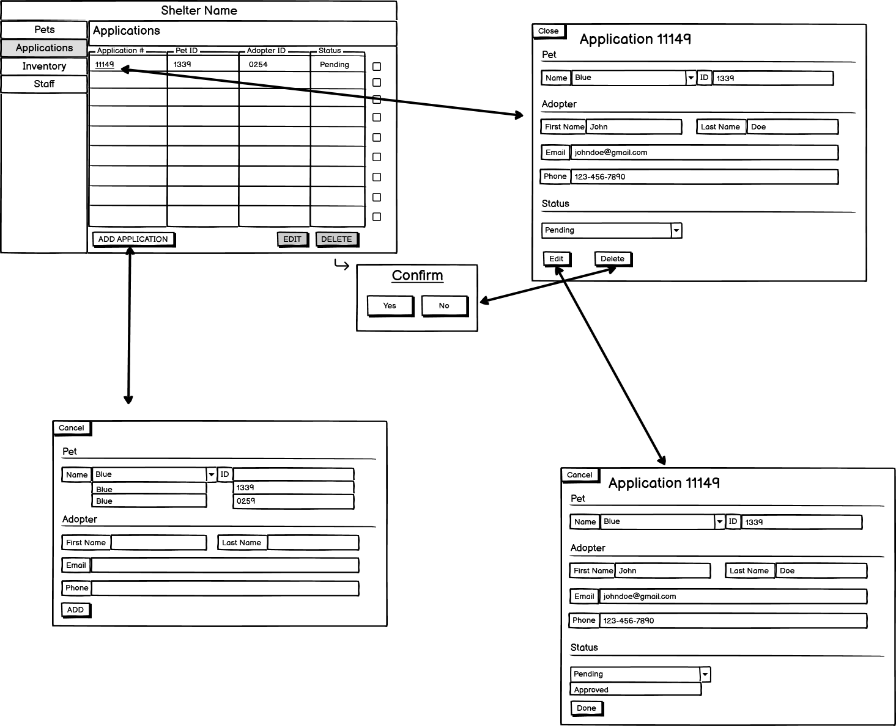
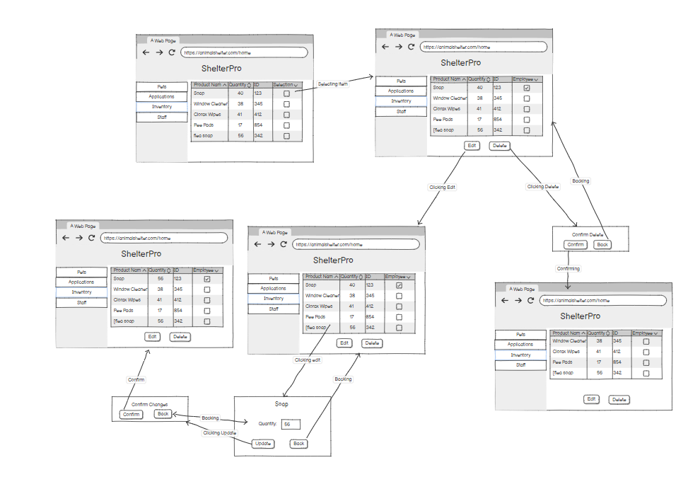

# User Flows
## Landing/Main application

 
**1.) User starts on Log In page.**

**2.) User inputs credentials, Staff ID and password**

**3.) User clicks enter or log in button**

**4.) The credentials are checked for access**

**4a.) If credentials INVALID, error message is displayed to User, prompting to try again**

**4b.) If credentials VALID, the User is brought to main page** 
## Search

1.) The Application opens on a Log in screen

2.)User Logs in

3.) opens to the pets page as the home page

4.) User selects the desired page from the lefthand menu

5.) User navigates and clicks on the search bar

6.) User types in the desired search parameter

7.) All entries with the search parameter appears 

8.) User Selects desired entry and performs whatever it is they needed the info with

## Create🫡

**1:Application opens on the log-in screen.**

**2:User logs in and navigates to the "Create Pet" page.**

**3:User fills in pet details and submits the form.**

**4:Pet is successfully created.**

**5:User moves to the "Create Adopter" section.**

**6:User fills in adopter details and submits the form.**

**7:Adopter is successfully created.**

**8:User navigates to the "Adoption Application" page.**

**9:User selects pet and adopter, sets application status, and submits.**

**10:Adoption application is successfully submitted.**

## Update
  

  1. ) The application opens up with a sign in page.
    
  3. ) The user logs in

  5. ) Opens up with the pets page as the main page
     
  7. ) The user can choose between tabs: Pets, Application, Inventory and Staff
     
  9. ) If they choose Pets they can click on the Pets name and a pop up with the animals info pops up. They can click the edit button on the bottom. The fields will be able to be changed. The user will then hit Update and a confirmation box will pop up. If they hit yes edits will be saved. If they hit no nothing will be changed.
      
  11. ) If they choose Applications or Staff its the same process as pets.
      
  13. ) If they choose Inventory it can be changed by hitting the Edit button on the bottom on the Inventory page. Edit the fields they would like to change. Asks for confirmation and if they hit yes changes will be saved. 

## Delete
  
1.) The Application opens on a Log in screen

2.) User Logs in

3.) opens to the pets page as the home page

4.) User selects a tab

5a.) If the user selects staff the user will select a staff member from the list

5b.) User clicks the delete button

5c.) User clicks yes on the confirm Delete pop up

5d.) End of process

6a.) If the user selects Inventory the user will select an item from the list

6b.) User clicks the delete button

6c.) User clicks yes on the confirm Delete pop up

6d.) End of process

7a.) If the user selects Applications the user will select an application from the list

7b.) User clicks the delete button

7c.) User clicks yes on the confirm Delete pop up

7d.) End of process

8a.) If the user selects Pets the user will select a pet from the list

8b.) User clicks the delete button

8c.) User clicks yes on the confirm Delete pop up

8d.) End of process

# Wireframes
## Sign in
  

## Pets 
  

## Applications 
  

## Inventory 
  

## Staff 

